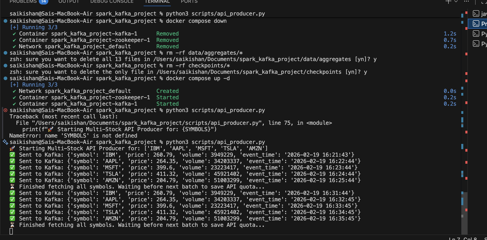
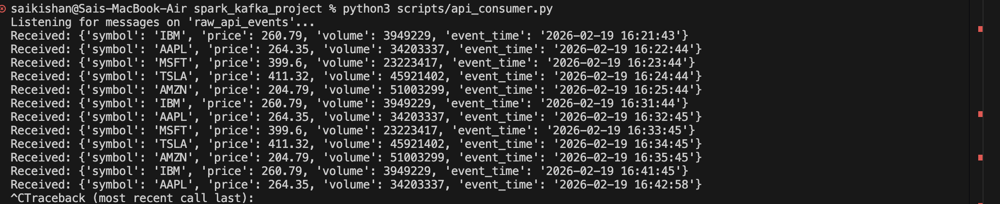
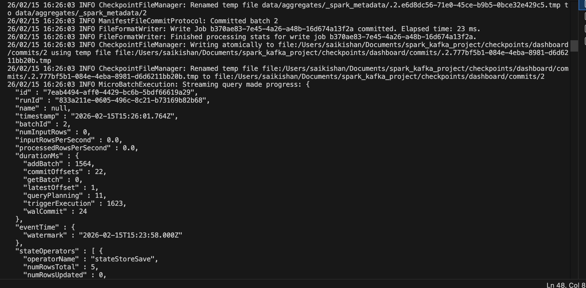
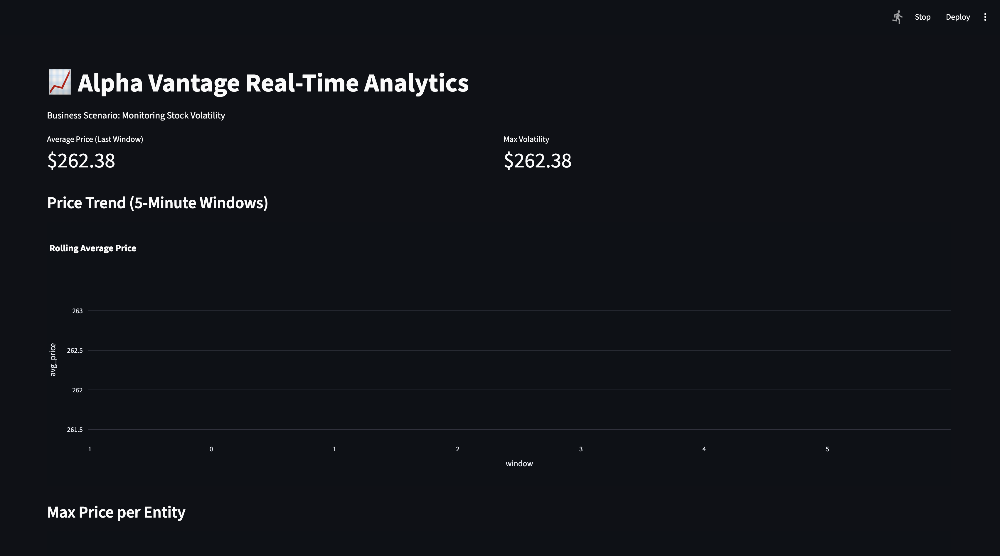

# 📈 Real-Time Stock Market Data Pipeline


## 1. Project Overview & Business Scenario
This project implements a complete, end-to-end real-time data processing platform. 
**Business Scenario:** E-commerce / Financial Markets (Scenario 2.2).
The objective is to track the real-time price evolution of multiple top-tier tech stocks (IBM, AAPL, MSFT, TSLA, AMZN). The pipeline detects market volatility by aggregating rolling averages and maximum price spikes within specific time windows.

**Real-Time KPIs Computed:**
* **Average Price:** Computed over a rolling 1-minute window to track immediate trend lines.
* **Maximum Volatility (Max Price):** Captures the highest price point within the current window to assess sudden market spikes.

---

## 2. Architecture & Data Flow


The pipeline follows a decoupled, distributed streaming architecture:
1.  **Ingestion Layer:** A Python producer fetches JSON data from a REST API and normalizes it.
2.  **Message Broker:** Apache Kafka buffers the high-throughput streaming events.
3.  **Processing Layer:** Spark Structured Streaming consumes the Kafka topic, applies watermarking and windowed aggregations, and sinks the state to Parquet files.
4.  **Exposure Layer:** A Streamlit dashboard continuously polls the Parquet state store to update real-time charts.

---

## 3. Data Source & API Presentation
* **API Provider:** Alpha Vantage (`GLOBAL_QUOTE` endpoint)
* **Base URL:** `https://www.alphavantage.co/query`
* **Authentication:** API Key passed in the URL parameters.
* **Constraints:** The Free Tier is strictly limited to **25 calls per day**. 

**Security Note:** The API Key is securely managed using a `.env` file (see `.env.example`). It is loaded via environment variables to prevent credential leakage.

**Example JSON Response:**
```json
{
    "Global Quote": {
        "01. symbol": "IBM",
        "05. price": "184.5000",
        "06. volume": "120543"
    }
}
```

## 4. Component Deep Dive
api_producer.py (The Ingestion Engine)
Fetches data for multiple ticker symbols from Alpha Vantage. Includes defensive programming to handle API rate limits and normalizes the JSON to explicitly include an event_time timestamp required for Spark's event-time processing.



debug_consumer.py (The Validation Layer)
A standalone Kafka consumer used strictly for unit-testing the ingestion layer. It verifies that JSON schemas are correctly formatted and enqueued in the raw_api_events topic before Spark consumption.



streaming_app.py (The Processing Engine)
A Spark Structured Streaming job that reads from Kafka.

* **Transformations:** Parses JSON using a strict StructType schema.

* **Windowing**: Uses window() to group data by symbol over time.

* **Watermarking**: Implements withWatermark("event_time", "0 seconds") to handle late-arriving data while ensuring micro-batches are flushed to disk immediately for real-time dashboarding.

* **Sink**: Uses append mode writing to partitioned Parquet files for robust state storage.



dashboard.py (The Visualization UI)
A Streamlit web application that acts as the final consumer. It uses pyarrow to read the Spark-generated Parquet folder, drops historical window duplicates, and renders Plotly charts reflecting the live KPIs.




### 5. Step-by-Step Execution Guide
**Prerequisites**
* Docker & Docker Compose

* Python 3.10+

* Apache Spark 3.5.0 (Standalone Binary Recommended)

**Startup Sequence**

**a. Start the Kafka/Zookeeper Infrastructure:**
```
Bash
docker-compose up -d
```

**b. Clean Previous State (Crucial for Checkpointing):**
```
Bash
rm -rf data/aggregates checkpoints
```
**c. Start the Producer:**
```
Bash
source .venv/bin/python
```
python scripts/api_producer.py
(Note: If API limits are reached, run python scripts/mock_producer.py to generate synthetic data).

**d. Start the Spark Processing Job:**
```
Bash
export SPARK_HOME="/path/to/spark-3.5.0-bin-hadoop3"
$SPARK_HOME/bin/spark-submit --packages org.apache.spark:spark-sql-kafka-0-10_2.12:3.5.0 scripts/streaming_app.py
```
**e. Launch the Dashboard:**
```
Bash
streamlit run scripts/dashboard.py
```
### 6. Technical Decisions, Limits, and Future Improvements**

**Technical Challenges Overcome**

* **Environment Mismatches:** Encountered a GeographyType Python Type-Hint error when using Homebrew's Spark 4.1.1. Resolved by enforcing a strictly version-controlled standalone Spark 3.5.0 binary to match the .venv Python 3.10+ runtime.

* **Parquet Append Delay:** Spark's default watermarking retains data in memory until the window closes. Tuned the watermark to 0 seconds and added a trigger(processingTime='2 seconds') to force immediate file writes, enabling sub-minute latency for the UI.

**Production Limits & Risks**
* **API Rate Limits:** Alpha Vantage's 25 calls/day is insufficient for sustained real-time streaming.

* **Local File System Sink:** Writing Parquet to a local disk is not scalable. If the worker node dies, the dashboard loses its state store.

**Future Improvements**
* **Cloud Object Storage:** Migrate the Spark sink from local Parquet to an AWS S3 bucket or Delta Lake for true distributed storage.

* **WebSocket API:** Replace the REST API polling mechanism with a WebSocket connection (like Binance) to reduce network overhead and achieve true millisecond latency.

***

Author -  Sai Kishan Kumar & Aarya Patil

***